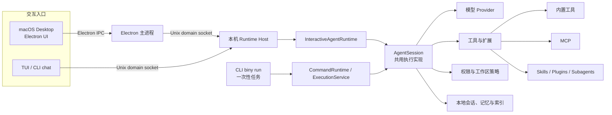

# Biny

**本地优先、记忆优先的开发协作 Agent，提供 macOS Desktop、TUI 与 CLI。**

Biny 帮你在本地项目中对话、处理开发任务，并把会话和记忆带到后续工作中。Desktop、TUI 与 CLI 的交互式任务共用本机 Runtime Host 和 AgentSession；模型由你配置，能力可通过 MCP、插件与 Skills 扩展。

[GitHub](https://github.com/binyouo/Biny-Agent) · [Issues](https://github.com/binyouo/Biny-Agent/issues) · [架构源码](src/runtime) · [Agent 与会话源码](src/agent)

## 架构



Desktop、TUI 与 CLI chat 共用本机 Runtime Host；`biny run` 是一次性任务入口，复用 AgentSession 执行核心。会话与记忆保存在本机。

## 核心能力

| 能力 | Biny 提供 |
| --- | --- |
| 多端交互 | macOS Desktop、终端 TUI 与 CLI chat；`biny run` 支持脚本化的一次性任务。 |
| 多层记忆 | 结合会话历史、项目上下文、临时与长期记忆，以及可检索的 Desktop Activity 线索；Sleep 周期会整理记忆、归档过期记忆并合并重复信息。 |
| Activity Recorder | 记录桌面活动与 OCR 线索，支持回看、检索和生成活动摘要；可从 Desktop 设置中暂停记录。 |
| 长任务执行 | 持久化 TaskRun 与 attempt 状态，支持 worker 检查点续跑、重试决策和任务完成后的验证。 |
| 模型与扩展 | 接入多家模型服务商和 OpenAI-compatible 接口；通过 MCP、Plugins、Skills、Subagents 扩展工具与工作流。 |
| 工具与操作控制 | 提供项目文件操作、受控命令和权限审批；Desktop 还可选 Computer Use 来观察桌面并操作指定窗口。 |

## 快速开始

需要 Node.js 与 pnpm `10.6.5`。克隆仓库并初始化：

```bash
git clone https://github.com/binyouo/Biny-Agent.git
cd Biny-Agent
corepack enable
corepack prepare pnpm@10.6.5 --activate
pnpm install --frozen-lockfile
pnpm dev -- init
```

完成模型配置后，启动终端对话或 Desktop：

```bash
pnpm dev -- chat
pnpm desktop:dev
```

CLI 帮助：`pnpm dev -- --help`。

## 继续了解

- [Agent 执行与 Runtime](src/agent) · [Host 实现](src/runtime/host)
- [会话存储](src/session) · [长期记忆与上下文](src/agent/context)
- [工具与扩展](src/extensions) · [权限策略](src/permission) · [工具实现](src/tools)
- [问题反馈与功能请求](https://github.com/binyouo/Biny-Agent/issues)
