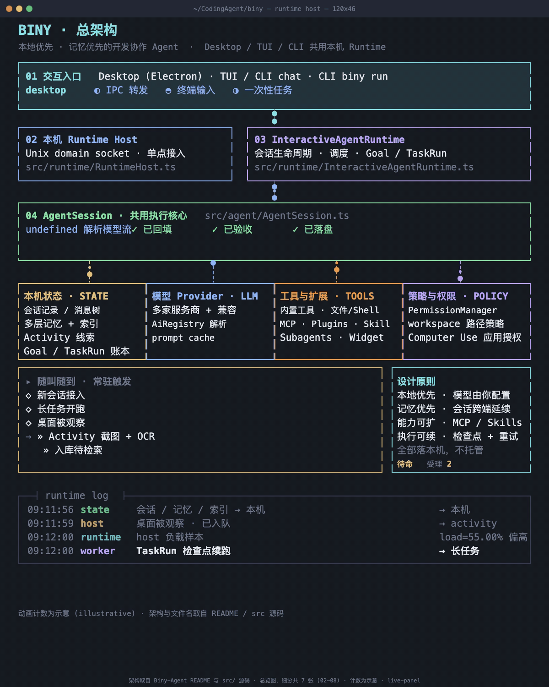

# Biny

**本地优先、记忆优先的开发协作 Agent，提供 macOS Desktop、TUI 与 CLI。**

Biny 帮你在本地项目中对话、处理开发任务，并把会话和记忆带到后续工作中。模型由你配置，工具与工作流可通过 MCP、插件和 Skills 扩展。

[GitHub](https://github.com/binyouo/Biny-Agent) · [Issues](https://github.com/binyouo/Biny-Agent/issues)

## 架构



Desktop、TUI 与 CLI chat 共用本机 Runtime Host；`biny run` 提供一次性任务入口。会话与记忆保存在本机。

动画中的状态、日志与计数为示意值。可查看 [静态图](architecture-panels/assets/overview.png)，模块职责与数据流见 [架构说明](docs/ARCHITECTURE.md)。

## 核心能力

| 能力 | Biny 提供 |
| --- | --- |
| 多端交互 | macOS Desktop、终端 TUI 与 CLI chat；`biny run` 支持脚本化的一次性任务。 |
| 交互式可视化 | 在 Desktop 聊天中生成可交互的 HTML/SVG 内容，也可导出独立页面。 |
| 多层记忆 | 结合会话历史、项目上下文与长期记忆，支持检索和整理。 |
| Activity Recorder | 记录桌面活动与 OCR 线索，支持回看、检索和活动摘要。 |
| 长任务执行 | 保存会话目标与任务进度，支持检查点续跑、重试和完成验证。 |
| 模型与扩展 | 接入多家模型服务商和 OpenAI-compatible 接口；通过 MCP、Plugins、Skills、Subagents 扩展工具与工作流。 |
| 工具与操作控制 | 操作项目文件、执行受控命令；Desktop 可通过应用授权观察和操作 macOS 窗口。 |

## 快速开始

需要 Node.js 与 pnpm `10.6.5`。克隆仓库并初始化：

```bash
git clone https://github.com/binyouo/Biny-Agent.git
cd Biny-Agent
corepack enable
corepack prepare pnpm@10.6.5 --activate
pnpm install --frozen-lockfile
pnpm dev -- init
```

完成 [模型配置](docs/CONFIGURATION.md) 后，启动终端对话或 Desktop：

```bash
pnpm dev -- chat
pnpm desktop:dev
```

CLI 帮助：`pnpm dev -- --help`。

## 文档

完整阅读入口见 [文档索引](docs/README.md)。

- [docs/CONFIGURATION.md](docs/CONFIGURATION.md) — 服务商、模型别名、凭据与项目设置。
- [docs/SESSIONS.md](docs/SESSIONS.md) — 对话入口、会话恢复、分支与导入导出。
- [docs/IMPORTS.md](docs/IMPORTS.md) — 从其他应用导入模型、MCP 与会话，管理同步和历史。
- [docs/MEMORY.md](docs/MEMORY.md) — 长期事实的写入、召回、整理与管理。
- [docs/PERMISSIONS.md](docs/PERMISSIONS.md) — 工具权限模式、沙箱与应用授权边界。
- [docs/EXTENSIONS.md](docs/EXTENSIONS.md) — MCP、Skills、Plugins 与子代理。
- [docs/BROWSER.md](docs/BROWSER.md) — 内置浏览器与 Chrome 标签连接。
- [docs/COMPUTER_USE.md](docs/COMPUTER_USE.md) — macOS 权限、应用审批、窗口镜像与外部 MCP。
- [docs/ACTIVITY.md](docs/ACTIVITY.md) — 桌面采集、OCR、活动分析、工作日记与 Appshots。
- [docs/AUTOMATION.md](docs/AUTOMATION.md) — 会话目标、任务图与定时执行。
- [docs/ARCHITECTURE.md](docs/ARCHITECTURE.md) — 运行链路、模块职责与本地状态。
- [docs/EVALUATION.md](docs/EVALUATION.md) — 实现检查、模型评测与成绩口径。

## 贡献与安全

- [CONTRIBUTING.md](CONTRIBUTING.md) — 开发环境、构建、验证与文档维护。
- [工具与权限](docs/PERMISSIONS.md) — 文件、命令、扩展和桌面控制的安全边界。
- [Issues](https://github.com/binyouo/Biny-Agent/issues) — 问题反馈与功能请求。
- [第三方声明](THIRD_PARTY_NOTICES.txt) — 第三方依赖的版权与许可证说明。
