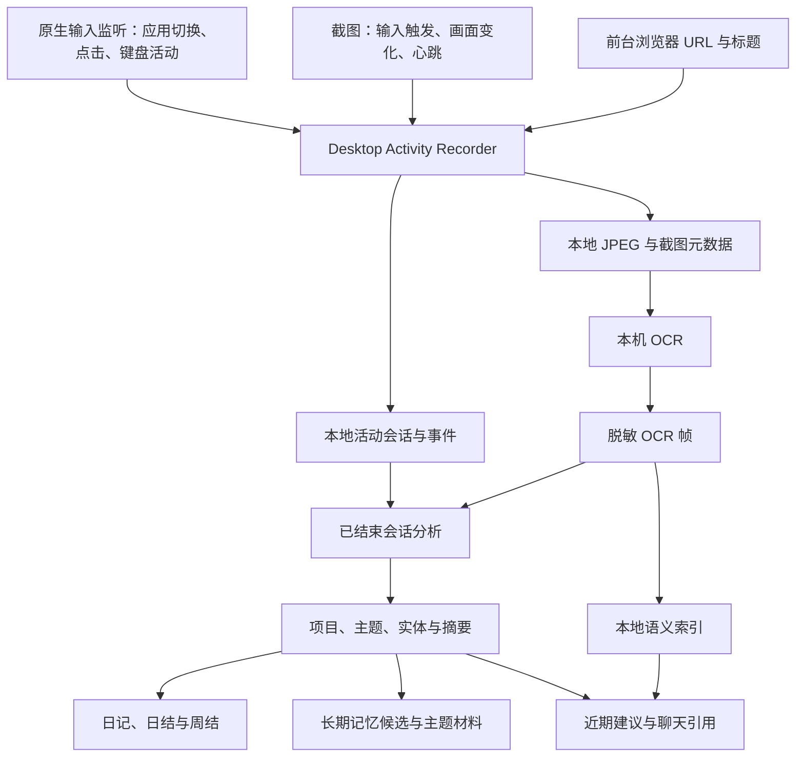

# 活动记录与 Appshots

Activity 将本机桌面活动保存为可回看的会话，再从事件与屏幕文字中提取项目、主题和工作线索。这些记录用于查找看过的资料、生成工作日记，以及为后续聊天提供近期上下文。

Appshots 捕获当前应用窗口，并将截图与可读取的窗口文字加入聊天草稿。它有独立的快捷键与捕获链路，不要求开启持续活动记录。

## 数据如何流转



采集和后台调度由 Desktop 主进程中的 `ActivityRecorderService` 管理，原生进程负责输入监听、截图和 OCR。CLI 的查询与报告直接复用活动存储和领域模块；`activity start` 与 `stop` 更新共享配置，实际采集仍需 Desktop 宿主运行。

## 记录的内容与会话边界

| 资料 | 保存的内容与作用 |
| --- | --- |
| 输入事件 | 应用切换、点击、键盘活动、锁屏与解锁等时间锚点；键盘活动保留键码、修饰键和计数，不保存输入字符正文。 |
| 浏览器事件 | 前台 Safari、Chrome 或 Edge 的当前标签 URL 与标题；URL 去掉账号、查询参数和片段。 |
| 截图 | JPEG 文件，以及捕获时间、应用、窗口、尺寸和触发原因。 |
| OCR 帧 | 截图识别出的文字，写入前按规则脱敏；异步 OCR 完成后回填到同一张截图。 |
| 会话分析 | 项目、标题、描述、主题，以及可识别的 PR、提交、人物、版本、链接和工作线索。 |

这里的“活动会话”是一段桌面活动，拥有独立 ID，与聊天会话不同。首次有效事件或截图创建会话；输入与焦点事件刷新空闲计时，默认空闲 30 秒后结束，锁屏也会结束当前会话。浏览器轮询只附着已有会话，截图与浏览器轮询不会持续延长输入空闲计时。

截图由应用切换、点击、输入停顿、画面变化检查和心跳触发。捕获会去抖，并通过缩略图直方图和像素差异过滤重复画面；默认心跳为 120 秒，画面与浏览器检查间隔为 12 秒，OCR 默认每三帧处理一次。因此事件数量、截图数量和 OCR 数量各自统计，并非一一对应。

输入监听不可用但截图条件满足时，宿主可以继续按截图路径记录；缺失的输入事件不会由截图伪造补齐。锁屏、敏感应用或无法确认前台应用时停止相应捕获。状态中的 `running`、`paused`、`permission_required`、`unavailable` 和 `error` 描述运行情况，配置中的 `enabled` 只表示启用选择。

## 后台分析与记忆

分析器读取已结束会话的脱敏事件与 OCR 文本，使用当前配置解析出的 `toolModel`，不把截图原图交给分析模型。模型返回结构化分析，保存后再供报告与聊天使用。

默认启动两分钟后首次检查，之后每十分钟检查待分析会话，近期有用户输入时跳过该轮。分析前会合并间隔不超过五分钟且应用集合重叠或有一方为空的相邻待分析会话；短暂、少量活动可以直接标为琐碎，不发起模型请求。

分析结果记录模型、输入摘要哈希和状态。输入未变时可复用已有结果；无模型或失败会留下跳过或失败原因，显式 `activity analyze <session-id>` 可重新分析。取消后不保存迟到结果，采集成功也不表示分析成功。

有价值的分析可以提出长期记忆候选，并将材料加入主题沉淀。分析先落库，记忆与主题写入分别处理；它们失败时不会回滚分析。因此“已分析”“已写入记忆”和“已形成主题材料”是不同结果。长期事实管理见 [长期记忆](MEMORY.md)。

## 检索、报告与聊天如何使用记录

| 入口 | 实际读取与生成方式 |
| --- | --- |
| `sessions` / `show` | 读取活动会话、事件、截图元数据与已有分析，保留回看来源。 |
| `search` | 在本地活动文字中匹配关键词。 |
| `search semantic` | 使用本地 `multilingual-e5-small` 查询已有 OCR 帧向量；查询不批量补建索引。 |
| `digest` | 汇总当前会话、今日统计和近期已分析会话，不调用分析模型。 |
| `report` | 读取指定日期已有分析，按项目与主题生成日记骨架；可再用工具模型生成叙事正文，失败时保留骨架。 |
| `summary daily` / `weekly` | 聚合会话时长、应用、截图与关键时刻；添加 `--narrative` 时才额外请求叙事模型。 |

OCR 向量由后台补齐。模型未下载、运行时不可用或尚无向量时，语义搜索返回原因和关键词搜索入口，不把缺失索引解释为没有相关活动。

日报不会在读取时补跑全部待分析会话，`--force` 刷新报告也不等于强制分析。输出保留尚未分析的数量与范围提示；`--skeleton` 返回确定性骨架。报告保存到活动库，并写入每日笔记的活动记录部分。

日期按本地日历组织，周结覆盖所选结束日往前七天。日结按会话开始日期选取完整会话，不按午夜裁剪时长。应用时长、截图和模型提取的成果都是采集资料的聚合；屏幕上出现某个操作不能证明它已经完成。

新聊天页可从已分析活动生成近期建议。点击建议只提交建议内容，输入框中未发送的正文、引用和附件仍保留在当前窗口的新聊天草稿中，返回新聊天后可继续编辑。聊天中的问候或相关问题也可触发简短活动引用；相关性召回读取已有本地 OCR 向量，再引用对应分析，超时或缺少可用结果时跳过。建议和引用不会自行创建持续目标或提交任务。

## 存储、模型调用与清理

活动会话、事件、OCR、分析和日周摘要保存在全局运行目录的 `agent.sqlite`，与长期记忆共用数据库；JPEG 默认放在 `~/.biny/agent/activity-records/snapshots/`，可由 `activity.outputDirectory` 调整。活动库属于全局本机数据，从某个项目执行 CLI 不会将其变成该项目独有的记录。

OCR 文字和事件文字按规则脱敏，JPEG 保留捕获画面，不做同等文字脱敏。会话分析、报告叙事与建议生成可能将各自需要的文字发给已配置的模型服务；本地保存不能据此解释为所有处理都使用本地模型。OCR 语义检索使用本地模型，日周结的叙事输入使用聚合统计与会话标题。

截图按年龄从 `hot` 降到 `warm`、`cold`，轮换支持降低尺寸与质量；超过 30 天的冷截图可淘汰。默认截图容量预算为 10,240 MiB，超过预算时淘汰旧截图。删除截图记录会级联删除关联 OCR 与其向量，事件和已保存分析可以继续存在；该预算不是整个 SQLite 库的大小上限。

暂停停止采集与相关后台任务，保留已有资料。清空活动记录删除活动会话、事件、截图、OCR 和摘要，并阻止旧任务结果回写；已经沉淀的长期记忆、主题内容、每日笔记和手动导出文件需要分别管理。

## Appshots

Appshots 使用原生快捷键监听捕获当前应用窗口，带回截图、应用与窗口身份，以及可读取的辅助功能文字。Desktop 接收捕获结果后，将其保存为当前或新聊天的附件，等待用户编辑并发送；发送前不请求聊天模型。

捕获与草稿附件交接有独立状态。原生临时图片读入后删除，尚未交接的图片暂存在内存中，五分钟后不能再领取。捕获和领取时都会检查敏感应用限制；辅助功能文字不可用时会记录相应错误，不能把它当作已经读取成功。

在“设置 → Appshots”选择双击修饰键或组合快捷键、当前或新聊天草稿，并测试系统权限与快捷键注册。Appshots 不依赖 Activity 的启用开关，也不会开启 Computer Use 的应用操作权限。

## 配置与查询入口

Desktop 设置管理活动记录的启用和采集参数。屏幕截图需要 macOS 屏幕录制权限，输入监听和窗口文字读取还受对应系统权限约束。

```bash
biny activity status --json
biny activity sessions --json
biny activity show <session-id> --json
biny activity search "项目名称" --json
biny activity report today --skeleton --json
```

CLI `status` 返回配置和存储统计；判断宿主是否正在采集，还需查看 Desktop 的运行状态。详细命令参数见 `biny activity --help` 及子命令帮助。

实现入口：[采集宿主](../src/desktop/electron/main/ActivityRecorderService.ts)、[存储](../src/activity/store.ts)、[分析](../src/activity/analyzer.ts)、[语义检索](../src/activity/semanticSearch.ts)、[Appshots](../src/computer/appshots.ts)。窗口控制与镜像见 [Computer Use](COMPUTER_USE.md)。
