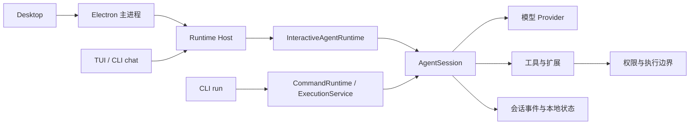

# 架构

Biny 的交互入口、执行核心和持久数据有各自职责。Desktop 与终端将用户操作交给 Runtime，AgentSession 处理模型与工具循环，历史和任务状态由本地存储保存。

## 执行链路

交互式客户端通过本机 Unix socket 连接 Host。一次性 `run` 可附着已有 Host，或在独立命令运行环境中复用执行核心；它不要求创建第二套 Agent 行为。

Desktop 进入项目或打开历史会话时，在后台准备该项目的 Host，首屏与历史正文不等待冷启动。同项目的会话共用一个 Host，初始化期间的发送等操作等待并复用同一次启动。预热失败通过运行状态报告，历史仍可读取；读取侧栏、工具目录与持久投影本身不启动 Host。当前项目保持连接，切走或关闭客户端后，Desktop 新启动的独立 Host 在没有运行任务或其他保活职责时最多驻留 10 分钟，再按空闲规则回收。

## 目录与职责

| 目录 | 职责 |
| --- | --- |
| [`src/desktop/`](../src/desktop/) | Electron 主进程、IPC、界面和系统集成。 |
| [`src/tui/`](../src/tui/) | 终端布局、键盘交互与运行事件展示。 |
| [`src/cli/`](../src/cli/) | 参数解析、命令注册和非界面入口。 |
| [`src/agent/`](../src/agent/) | 回合准备、上下文、模型请求与工具循环。 |
| [`src/runtime/`](../src/runtime/) | Host、会话执行、TaskRun、依赖图和调度。 |
| [`src/session/`](../src/session/) | 对话事件、恢复、分支、搜索与传输。 |
| [`src/llm/`](../src/llm/) | Provider、模型别名、目录与请求参数。 |
| [`src/extensions/`](../src/extensions/) | MCP、Skills、Plugins、子代理与计划。 |
| [`src/permission/`](../src/permission/) | 工具准入与授权决策。 |
| [`src/computer/`](../src/computer/) | 原生电脑控制的协议、审批与驱动。 |

界面适配协议并展示结果，不能把自己的临时队列或卡片状态当作完成事实。核心逻辑通过可独立使用的模块和非界面入口复用。

## 状态保存

| 数据 | 事实来源与用途 |
| --- | --- |
| 对话与工具历史 | Session JSONL，保存用户、助手、工具调用、工具结果与错误事件。 |
| 回合断点与写入所有权 | 会话断点、租约和 Runtime 记录，用于安全恢复与单写入者约束。 |
| 长任务、目标与调度 | Runtime authority 的事件与 SQLite 状态，关联 run、attempt、claim 和验证。 |
| 标题、归档与分支关系 | 会话 catalog，负责列表和管理。 |
| 长期事实与活动记录 | 全局本地 SQLite；向量和检索索引属于派生数据。 |
| 模型和用户设置 | 全局配置与项目覆盖；凭据正文使用独立存储。 |

列表、搜索和 UI 都是投影。投影错误不直接证明原始历史被删除，UI 显示的耗时也不等于服务商请求耗时。

全局设置默认在 `~/.config/biny/`，按项目分区的运行数据在 `~/.biny/agent/`。具体路径与覆盖规则见 [模型与配置](CONFIGURATION.md)。

## 恢复与外部副作用

恢复先读取持久状态，核对断点、策略、目标身份和已有工具结果。可证明未派发的操作与已经派发但结果未知的操作使用不同处理方式。

已完成结果进入上下文并复用。缺少可信结果的外部写入不能仅因超时、取消或进程重启而再次执行。Graph 的完成、TaskRun 的验证和模型的文字报告也分别判断。

查看已有会话、任务或目标的冷读路径应使用持久投影；管理查询的职责不包括启动新 Agent 回合。部分 CLI 服务仍需连接 Host，具体入口以各自实现为准。

## 模型与扩展

服务商配置别名、Biny 模型别名和远端模型 ID 分开解析。目录元数据不能改写用户端点、鉴权或协议。每个根回合固定运行快照，后续保存的选择从新根回合生效。

MCP 是外部协议边界，Plugin 是进程内代码边界，Skill 是指令与资源边界。它们共用工具注册和执行约束，但不能互相代替隔离保证。

浏览器和 Computer Use 各有实际执行端、目标引用与监督画面。预览属于临时展示，不作为模型观察、会话恢复或工具完成证据。

## 继续阅读

- [会话与恢复](SESSIONS.md) — 历史、分支、导入导出和未知结果。
- [工具与权限](PERMISSIONS.md) — 准入、沙箱、应用授权与直接 CLI。
- [目标与自动化](AUTOMATION.md) — 目标、任务、依赖图和定时触发。
- [贡献指南](../CONTRIBUTING.md) — 开发与验证入口。
