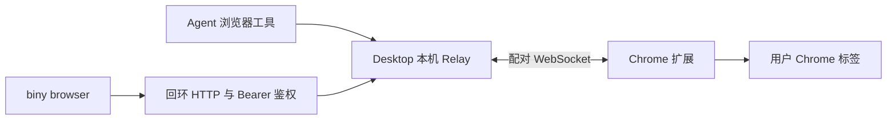

# 浏览器

Biny 提供内置浏览器与 Chrome Relay。内置页面适合新的网页任务和项目预览；Chrome Relay 连接用户已经打开的标签，保留该 Chrome 配置的登录态。

## 页面由谁执行

内置浏览器由 Desktop 的浏览器执行端管理页面。Agent 将打开、读取和交互请求交给执行端，执行端返回页面文字、定位信息或动作结果；页面的登录态属于内置浏览器自身。

Chrome Relay 的链路是：



Relay 管理配对连接与请求，扩展在目标 Chrome 配置中读取或操作标签，网页继续使用该配置已有的登录态。连接描述保存到全局运行目录的私有 `browser-relay.json`；配对地址用于扩展连接，CLI 用其中的端口和令牌访问本机 HTTP 入口。服务运行、扩展连接和目标标签可用是三个不同状态。

每次扩展连接分配新的 `browserId`，标签使用该连接下的 `tabId`。请求在派发前校验参数与连接，返回后校验结果；同一连接同时只接受一项在途请求。超时、取消或断线后，已派发的修改可能返回 `unknown`，连接恢复不会重发动作。

读取返回页面内容与定位信息，交互只对当前目标执行。iframe 的 `frameId`、`documentId` 进一步限定文档身份；页面导航后旧引用不能继续代表新文档。监督画面是临时预览，不更新这些操作引用，也不证明网页提交完成。

## 选择入口

| 任务 | 入口 |
| --- | --- |
| 找资料或读取公开网页 | `WebSearch`、`WebFetch`。 |
| 在 Biny 中打开页面、检查本地预览 | `BrowserOpen`、`BrowserReadDom` 和后续交互工具。 |
| 使用日常 Chrome 标签或已有登录态 | Chrome Relay。 |

两种浏览器有各自的标签和登录态。导入 Cookie 不等于连接已有标签，内置浏览器也不能用来报告用户日常 Chrome 的当前状态。

## 连接 Chrome

1. 启动 Biny Desktop，在设置中打开浏览器页面。
2. 获取扩展安装目录。CLI 也可运行 `biny browser setup --json`。
3. 在 Chrome 的 `chrome://extensions/` 开启开发者模式，通过“加载已解压的扩展程序”加载该目录。
4. 从 Biny 浏览器设置复制配对地址，粘贴到扩展设置，保存并连接。
5. 在 Biny 中检查连接状态和标签列表。

配对地址含有连接信息，保留在自己的设备与扩展设置中，不放入公共文档或聊天日志。

## 列出与读取标签

```bash
biny browser status --json
biny browser tabs --json
biny browser read <browser-id> <tab-id> --json
```

标签按 `browserId` 分组。最多连接 8 个配对的 Chrome 配置，不同配置中的同号标签不是同一个目标。多个窗口各自可能有活动标签，不能把一个 `active` 标记直接当作唯一前台窗口。

读取后使用返回的真实 selector 和目标 ID：

```bash
biny browser click <browser-id> <tab-id> '<selector>' --json
biny browser fill <browser-id> <tab-id> '<selector>' '查询文本' --json
biny browser press <browser-id> <tab-id> Enter --json
```

重连会更换浏览器 ID；导航或框架更换也会使旧引用失效。重新列举和读取，不猜测新的 ID。操作后读取页面确认目标结果；成功发出点击不证明远端保存或提交已经完成。

## 截图、等待与文件

`biny browser act <method> --args '<JSON>' --json` 提供结构化入口，支持截图、滚动、等待、上传和下载。

文件使用当前工作区相对路径。截图与下载保存为新文件，目录应已存在；上传需要实际文件 input，设置文件后网站可能立即传输。iframe 操作需要读取结果中的当前 `frameId` 与 `documentId`，不跨导航复用框架引用。

确认框由用户手动处理。浏览器入口不提供任意 JavaScript 执行，不能假设可绕过站点权限、CORS 或系统保存框。具体参数见 `biny browser act --help` 和 [Relay 协议](../src/browser/relayProtocol.ts)。

## 内置浏览器的范围

Agent 使用 `BrowserOpen` 打开页面，通过 `BrowserReadDom` 读取文字和 selector，再使用点击、输入与按键工具。每次交互后重新读取确认。

内置 `Browser*` 不提供独立浏览器实例池，也不具备 Chrome Relay 的全部文件、截图和高级定位能力。Desktop 浏览器执行端不可用时，不能把网页搜索或 Chrome Relay 声称为同一个页面。

## 排查

| 现象 | 处理 |
| --- | --- |
| 未连接 | 检查 Desktop 是否运行、扩展是否加载及配对设置。 |
| 旧 ID 不存在 | 重新列出浏览器与标签。 |
| 目标不唯一或不可点击 | 重新读取并使用唯一、可见且可用的 selector。 |
| 操作超时或连接中断 | 检查页面是否已经发生操作，再决定下一步。 |
| 页面要求确认 | 由用户处理确认框后继续。 |

CLI 与模型工具使用相同浏览器连接，但直接 CLI 不经过模型工具审批。授权边界见 [工具与权限](PERMISSIONS.md)。

实现入口：[Relay 连接与请求](../src/browser/BrowserRelay.ts)、[CLI 连接客户端](../src/browser/relayClient.ts)、[请求与目标协议](../src/browser/relayProtocol.ts)。
