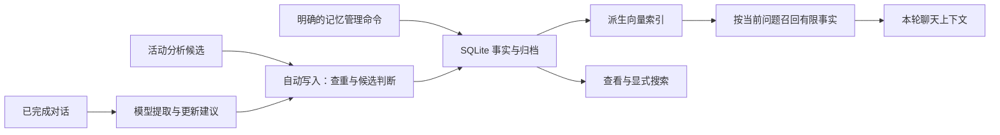

# 长期记忆

Biny 保存两类不同资料：会话历史记录当时发生的对话与工具操作，长期记忆保存适合以后使用的事实。修改一条记忆不会改写原始会话。

## 事实如何写入与使用



`MemoryStorage` 保存事实身份、正文、标签、重要度、来源锚点和归档关系。`LocalMemory` 编排模型提取、自动写入与 Sleep 整理，向量服务负责检索投影。事实写入和索引更新有各自结果；缺失索引时不能把事实库视为已经丢失。

自动贡献先从已完成对话或 Activity 分析中获取候选，再结合已有语义候选判断新增、更新或跳过。需要语义检索而当前不可用时可以延期，不能把一次提取请求当作已经成功写入。用户明确执行的添加与修改直接进入存储校验，不请求自动提取模型。

自动使用记忆发生在回合准备阶段：按当前问题查询可用语义结果，将有限事实加入上下文，而不是加载全部事实。贡献决定是否产生新记忆，使用决定是否自动召回，两个开关分别作用。Sleep 是独立维护过程，整理临时、重复和相似事实，并保留归档与维护记录。

## 记忆的范围

长期事实使用全局本地记忆库，可跨项目使用。`threadId`、`userId` 和标签用于来源与查询筛选，不构成访问控制或独立租户隔离。

会话历史仍按项目保存。查找“当时具体说了什么”应搜索历史；查找“已经保存的偏好或约定”应搜索记忆。正文、来源时间和关联消息是不同信息，记忆写入时间不代表事实发生时间。

## 查看与搜索

```bash
biny memory list --json
biny memory stats --json
biny memory search "项目约定" --json
biny memory grep "原文片段" --json
```

`list` 默认展示最近更新的 100 条活动事实。`stats` 查看数量和维护状态。`search` 搜索长期事实；`grep` 在对话历史中进行字面匹配，保留查询中的标点语义。

可以按来源筛选：

```bash
biny memory search "部署" --thread-id <session-id> --json
biny memory search "偏好" --tag preference --json
```

语义检索需要可用的 embedding。自动召回没有可用语义结果时不注入事实；显式搜索可以退化为文本匹配，并返回降级信息。没有结果不能据此断言相关事实不存在于全部历史中。

## 添加与修正

```bash
biny memory add "项目开发命令使用 pnpm" --json
biny memory get <memory-id> --json
biny memory update <memory-id> --entry '{"content":"项目统一使用 pnpm 10.6.5"}' --json
```

明确的管理命令直接校验并写入事实，不经过自动提取模型。每次 `add` 可以创建独立条目；添加前先查询已有内容，避免把修正写成重复的新事实。

结构化输入可使用 `--entry` 指定标签、重要度等受支持字段。保存稳定且自包含的内容；不要把密钥、猜测或未确认的模型结论当作用户事实。

更新时若提供 `content`，它必须是非空白字符串；非法正文会明确报错，不修改事实或同次提交的其他字段。只调整标签、重要度等信息时可以省略 `content`。

## 归档、恢复与删除

```bash
biny memory archive-entry <memory-id> --yes --json
biny memory archived --json
biny memory restore <archive-id> --json
biny memory delete <memory-id> --yes --json
```

归档使事实离开活动召回，仍可恢复。恢复使用归档 ID；永久删除使用活动记忆 ID，并要求显式确认。

`memory archive` 是另一种操作：将会话 transcript 导出为本地 Markdown，不归档长期事实，也不删除会话。`memory clear --yes` 的缺省范围是整个共享事实库；按会话清理需要明确传入 `--thread-id`。执行前确认范围，不能把项目目录当作全局清空的边界。

## 自动处理

启用记忆贡献时，已完成对话可触发后台提取与更新。提取使用模型，可能遗漏或误判；成功的聊天终态也不证明自动记忆处理已经成功。带外部上下文的回合是否参与提取由记忆策略决定。

自动使用记忆与贡献记忆是不同设置。关闭自动处理后，用户明确发起的查询与管理命令仍可使用。Sleep 维护可以整理重复、临时或过期事实，但不会把模型判断变成独立验证证据。

## 存储与排查

记忆事实、归档和向量投影保存在本地 `agent.sqlite`，该数据库还承载 Activity 数据。向量可重建，事实和活动记录不能当作缓存删除。

遇到旧库结构不兼容，保留原库并按明确迁移流程处理。检索异常先查看 `memory stats`、embedding 配置和服务状态，不通过删除数据库排障。

源码入口：[LocalMemory](../src/agent/context/LocalMemory.ts)、[记忆存储](../src/agent/context/memoryStorage.ts)。自动处理的模型选择见 [模型与配置](CONFIGURATION.md)。
